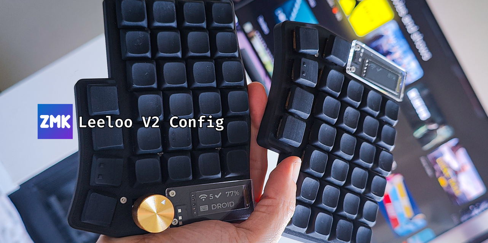
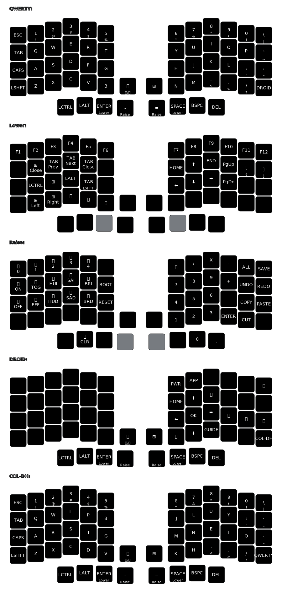
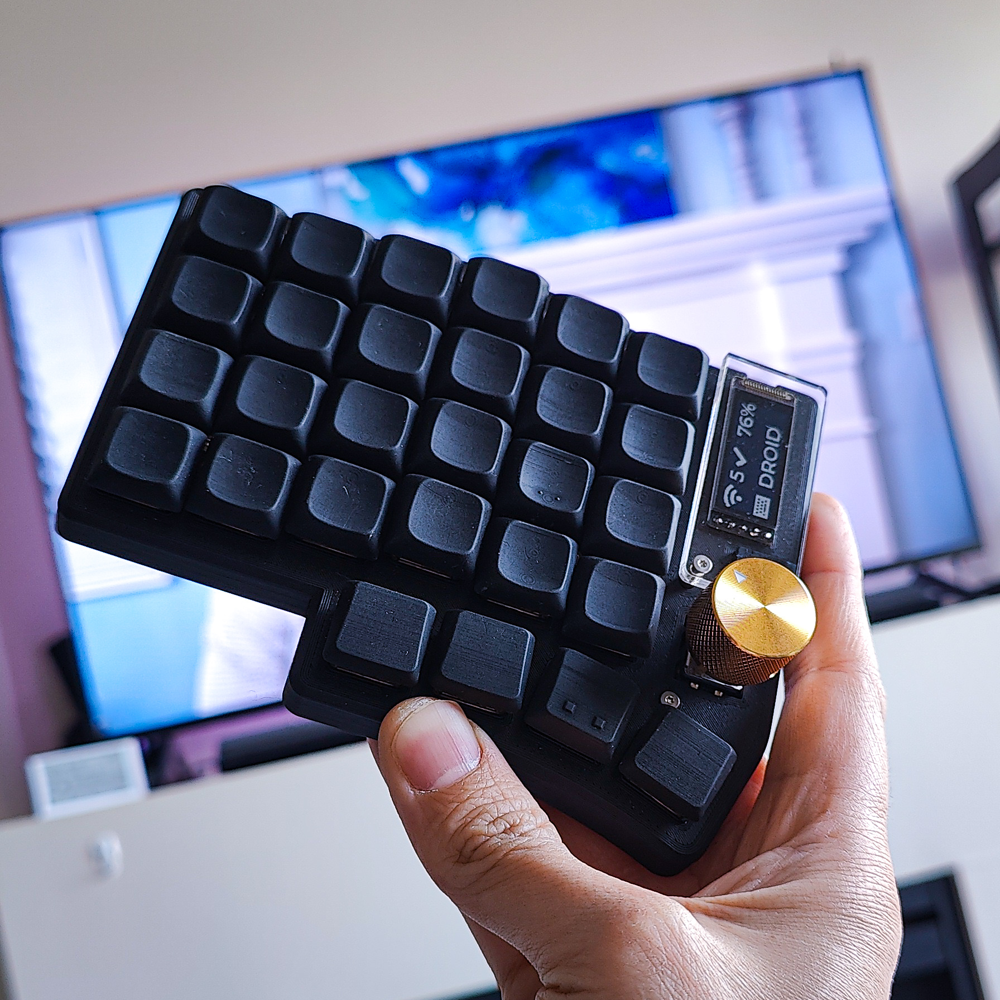

# zmk-config-leeloov2
ZMK Config for Leeloo V2

## Highlights

- QWERTY and Colemak-DH layout
- Added Numpad
- DROID layer can be used as remote control for Google TV (Should work on other android devices)

